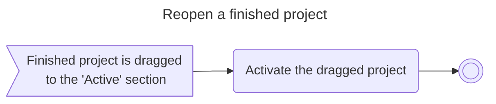

# Pet project based on Typescript that implements Drag&Drop functionality


## How to run

1. Install [node.js](download) in your OS (should be v20.5.1)
1. Install project's dependencies with the following command:
    ```shell
    npm install
    ```
1. Run webpack development server:
    ```shell
    npm run start
    ```
1. Open the following URL in your web browser: `localhost:8080`

Run the following command to build production verstion:
    
```shell
npm run build
```


## Activity Diagram




## Class Diagram

