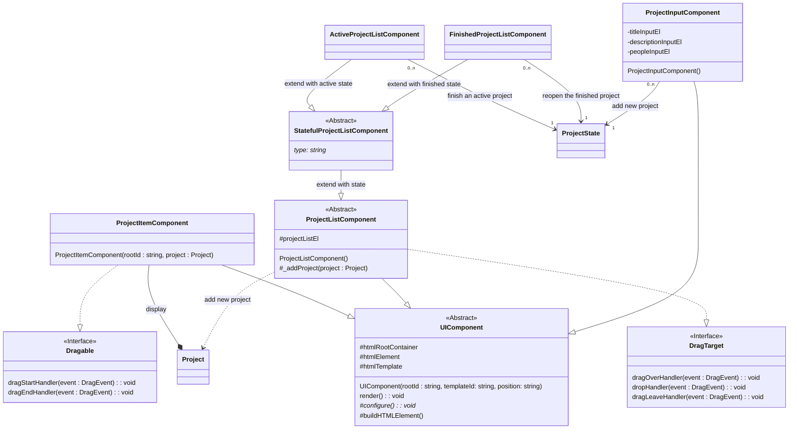

## Class Diagram

```mermaid
classDiagram

ProjectItemComponent --|> UIComponent
ProjectItemComponent --* Project : display
ProjectListComponent --|> UIComponent
ProjectListComponent ..> Project : add new project
ProjectItemComponent ..|> Dragable
ProjectListComponent ..|> DragTarget
StatefulProjectListComponent --|> ProjectListComponent : extend with state
ActiveProjectListComponent --|> StatefulProjectListComponent : extend with active state
ActiveProjectListComponent "0..n" --> "1" ProjectState : finish an active project
FinishedProjectListComponent --|> StatefulProjectListComponent : extend with finished state
FinishedProjectListComponent "0..n" --> "1" ProjectState : reopen the finished project
ProjectInputComponent --|> UIComponent
ProjectInputComponent "0..n" --> "1" ProjectState : add new project
class UIComponent {
    <<Abstract>>
    #htmlRootContainer
    #htmlElement
    #htmlTemplate

    UIComponent(rootId : string, templateId: string, position: string)
    render() : void
    #configure() : void*
    #buildHTMLElement()
}

class ProjectItemComponent {
    ProjectItemComponent(rootId : string, project : Project)
}

class ProjectListComponent {
    <<Abstract>>
    #projectListEl

    ProjectListComponent()
    #_addProject(project : Project)
}

class StatefulProjectListComponent {
    <<Abstract>>
    type: string*
}

class ActiveProjectListComponent

class FinishedProjectListComponent

class ProjectInputComponent {
    -titleInputEl
    -descriptionInputEl
    -peopleInputEl

    ProjectInputComponent()
}


class Dragable {
    <<Interface>>
    dragStartHandler(event : DragEvent) : void
    dragEndHandler(event : DragEvent) : void
}

class DragTarget {
    <<Interface>>
    dragOverHandler(event : DragEvent) : void
    dropHandler(event : DragEvent) : void
    dragLeaveHandler(event : DragEvent) : void
}
```