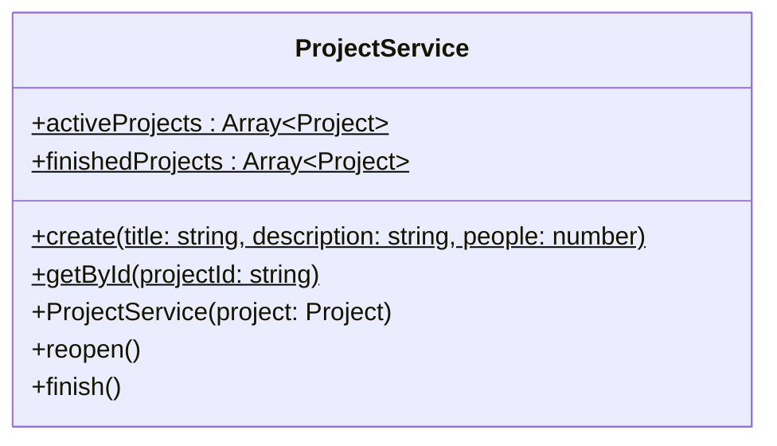

## Class Diagram of services

```mermaid
classDiagram
class ProjectService {
    +activeProjects : Array~Project~ $
    +finishedProjects : Array~Project~ $
    +create(title: string, description: string, people: number)$
    +getById(projectId: string)$
    +ProjectService(project: Project)
    +reopen()
    +finish()
}
```
