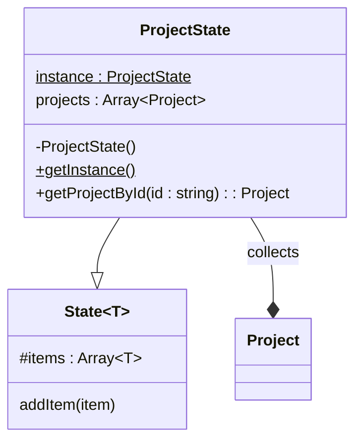

## Class Diagram of states

```mermaid
classDiagram

ProjectState --|> State~T~
ProjectState --* Project : collects
class State~T~ {
    #items : Array~T~
    addItem(item)
}

class ProjectState {
    instance : ProjectState$
    projects : Array~Project~
    -ProjectState()
    +getInstance()$
    +getProjectById(id : string) : Project
}
```