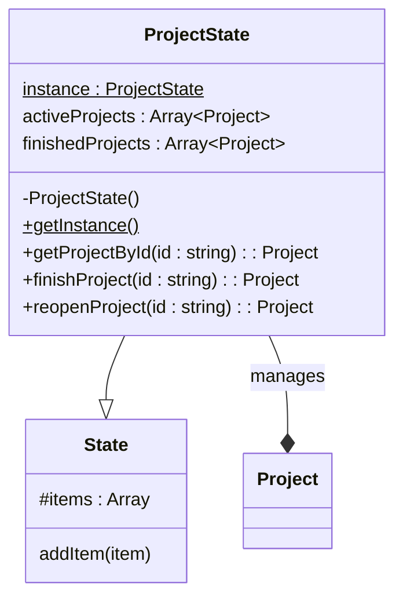

```mermaid
classDiagram

ProjectState --|> State
ProjectState --* Project : manages
class State {
    #items : Array
    addItem(item)
}

class ProjectState {
    instance : ProjectState$
    activeProjects : Array~Project~
    finishedProjects : Array~Project~
    -ProjectState()
    +getInstance()$
    +getProjectById(id : string) : Project
    +finishProject(id : string) : Project
    +reopenProject(id : string) : Project
}
```