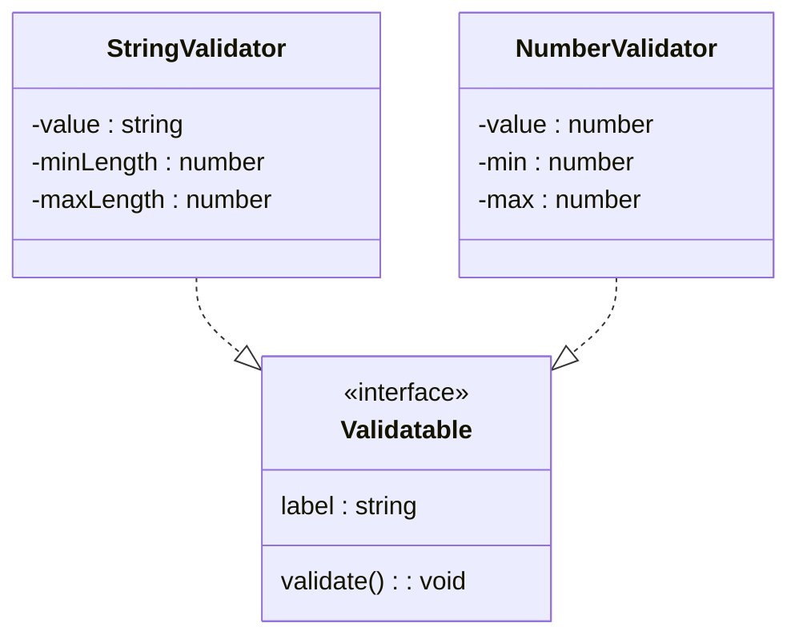

## Class Diagram

```mermaid
classDiagram
StringValidator ..|> Validatable
NumberValidator ..|> Validatable
class Validatable {
    <<interface>>
    label : string
    validate() : void
}

class StringValidator {
    -value : string
    -minLength : number
    -maxLength : number
}

class NumberValidator {
    -value : number
    -min : number
    -max : number
}
```