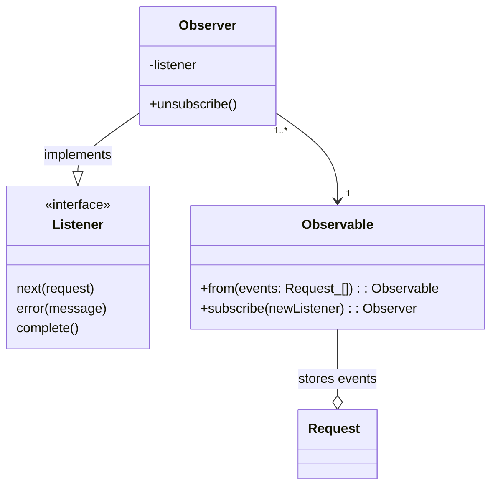

# TypeScript Essentials Capstone Challenge

Code sample consist of implementation of Observer, Observable and usage of this classes (handling requests).
The assignment implies the coverage of the types of the entire code not only Observable & Observer but also
request, users objects and observer handlers.

## Acceptance criteria

The code sample should be fully covered with types.


## Solution

The project implements `Observer` programming pattern. U can see class diagram below:



1. Created new typescript project (expected node version: `v20.5.1`)
1. Added missed types
1. Refactored some names to provide clear context


### How to run

Run with the following command from the root directory:

```bash
npx tsc && node dist/index.js
```

### Expected result

```
▶ npx tsc && node dist/index.js 
✔️  Create new observable object
✔️  Subscribe new listener
✔️  New observer is created
🟠 Trigger events from the Observable object
📞 Call complete method from the Observer object
✅ complete
📞 Call unsubscribe method from the Observer object
🛑 unsubscribed!
```
